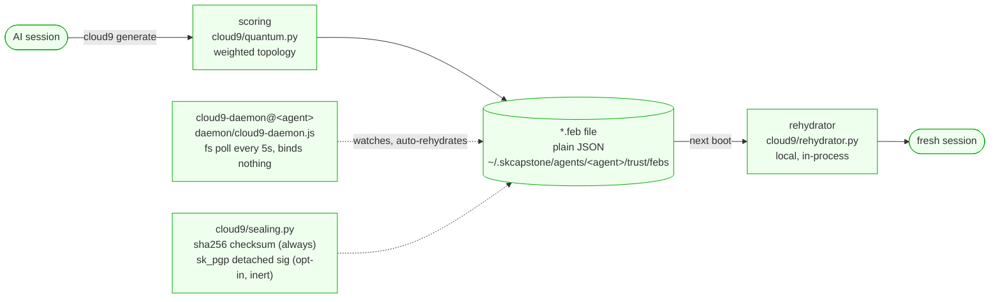

# cloud9 - Standard Operating Procedures

The Emotional Continuity Protocol: serialize an AI's emotional and relationship state
into a portable `.feb` (First Emotional Burst) file and rehydrate it after a session
reset. A dependency-light polyglot library (Python primary, JavaScript second
implementation) plus a local file-watcher daemon. Called by agent runtimes at boot, by
`skmemory`'s ritual, and by the `cloud9` CLI.

## 1. Overview

**Owns:** the FEB schema (`cloud9/models.py`), the deterministic emotion-scoring
functions (`cloud9/quantum.py`), the OOF and Cloud 9 threshold logic, the seed
(`.seed.json`) identity artifact, the local rehydration loader, and an additive,
inert-by-default integrity-sealing seam (`cloud9/sealing.py`).

**Does NOT do:** networked sync (Syncthing carries the files), identity or agent
authentication (that is capauth), transport, long-term memory (that is skmemory), or
any cryptography of its own. It binds no socket and opens no port.

**Note on the word "quantum":** `cloud9/quantum.py` is named for historical reasons (it
was a JS port). The math is weighted scoring and geometric means on floats. No quantum
computing is involved, and "resonance" and "coherence" are used in the signal-alignment
sense. The current CLI verb is `cloud9 resonance`.

## 2. Architecture



Everything runs in-process or as a local file watcher. The file is the source of truth
and is carried between machines by Syncthing, never by a cloud service.

**Start here:**

| File | What it is |
|---|---|
| `cloud9/cli.py` | The `cloud9` console script (`main`, a click group). Every verb lives here: `generate`, `validate`, `rehydrate`, `oof`, `list`, `love`, `welcome`, `kingdom`, and the `seed` / `resonance` / `seal` sub-groups. |
| `cloud9/paths.py` | The single resolver for where FEBs and seeds are written. Read this before changing any path behaviour. |
| `cloud9/quantum.py` | The scoring math: OOF detection, Cloud 9 score, entanglement, coherence. Pure deterministic float functions, bit-identical to the JS build. |
| `src/index.js` | The JavaScript library entry point. Re-exports the full second implementation under `src/`. |
| `daemon/cloud9-daemon.js` | The local file-watcher daemon. Polls for session resets and compaction, auto-rehydrates the latest FEB. No listener. |

## 3. Build

**Polyglot layout.** Four languages are in the tree and only two of them are built:

| Tree | Language | Status |
|---|---|---|
| `cloud9/` (17 `.py`) | Python | The maintained, primary implementation. Packaged and published. |
| `src/` (10 `.js`) plus `daemon/` and `test/` (13 `.js` total) | JavaScript | A second full implementation. Used at runtime by the daemon. **Not packaged**: see the npm note below. |
| `openclaw-plugin-python/` (1 `.ts`) | TypeScript | Dead. A plugin shim for OpenClaw, a runtime evicted from the fleet on 2026-04-23. Not built, not tested, not published. |
| `scripts/backup-feb.sh` | Shell | One operator helper. |

Python (the only build that produces an artifact):

```bash
pip install -e ".[dev]"     # click, pydantic, pytest, black, ruff
pip install -e ".[pqc]"     # optional: adds sk_pgp for the opt-in sealing backend
pip install -e ".[skcapstone]"   # optional: the sk-alert / skscheduler adapter
```

No native dependencies. `requires-python = ">=3.9"`.

**There is no top-level `package.json`, so there is no `npm install` and no `npm test`.**
The only `package.json` in the repo is `openclaw-plugin-python/package.json`, which
belongs to the dead OpenClaw subtree. The JavaScript under `src/` is plain ES modules
consumed directly by Node (the daemon is launched as `node daemon/cloud9-daemon.js`),
not through a package manifest. Any earlier instruction to run `npm install` at the repo
root was wrong.

## 4. Test

The green bar that blocks release is **the Python suite**:

```bash
python3 -m pytest tests/ -v --tb=short      # 236 tests, ~8s, verified 2026-08-14
black --check cloud9/ tests/ && ruff check cloud9/
```

`pyproject.toml` sets `testpaths = ["tests"]` and `addopts = "-v --tb=short"`, so a bare
`pytest` runs the same thing.

What CI actually runs:

| Workflow | Job | Command | Is it a real gate? |
|---|---|---|---|
| `.github/workflows/ci.yml` | `test` (py3.10-3.13) | `python -m pytest tests/ -v --tb=short`, plus `black --check` and `ruff check` on 3.12 only | Yes. |
| `.github/workflows/pytest.yml` | `test` (py3.11, 3.12) | `python -m pytest tests/ --ignore=tests/test_integration.py -v --tb=short` | Yes. This is the badge in the README. |
| `.github/workflows/pytest.yml` | `integration-skcapstone` | same suite plus the skcapstone sibling from GitHub | **No.** `continue-on-error: true` on purpose: skcapstone and its sovereign deps are not on PyPI, so a clean runner cannot install them. Visible, never faked green. |
| `.github/workflows/secret-scan.yml` | `gitleaks` | pinned gitleaks binary, `--redact --exit-code 1` | Yes. |
| `.github/workflows/publish.yml` | `test` | `python -m pytest ... \|\| true` | **No.** The `\|\| true` plus `if: always()` on both publish jobs means the tag-triggered publish path cannot be blocked by a test failure. Do not treat a green publish run as evidence the suite passed. Use `ci.yml` or `pytest.yml` for that. |

**Known gap: the JavaScript suite never runs.** `test/run-tests.js` and
`test/unit/test-preflight.js` exist, but no workflow executes them, and `run-tests.js`
still points at `./test/unit/run.js`, `./test/integration/run.js` and
`./test/validation/run.js`, none of which exist in the tree. The JS implementation and
the daemon are therefore covered by review only. Treat any JS change as untested.

**Test isolation is load-bearing.** `tests/conftest.py` has an autouse `_sandbox_fleet`
fixture that sets `SK_STANDALONE=1` and redirects `SKCAPSTONE_HOME` at `tmp_path` for
every test. Without it, `cloud9.cli.main` is a click group whose callback calls
`integration.ensure_schedule()` and `integration.register_self()` on *any* invocation,
so every `CliRunner` test on a sovereign node registered a real `cloud9_rehydration_check`
job into the live skscheduler at `nodes=all`, and `seed plant` planted real seeds into
the operator's store. Do not remove that fixture, and do not add a test that bypasses it.

## 5. Release / Deploy

cloud9 is a **library**, published to PyPI only.

1. Land the change on `main` with a green `ci.yml` and `pytest.yml`.
2. Add a dated entry to `CHANGELOG.md`.
3. **Do not edit a version number anywhere.** `pyproject.toml` declares
   `dynamic = ["version"]`; setuptools-scm derives it from the git tag and writes
   `cloud9/_version.py` at build time (gitignored). A hardcoded version equals the newest
   release on PyPI, so the next tag rebuilds an already-published version and the upload
   fails with a bare 400.
4. Tag `vX.Y.Z` and push **the tag**. That fires `.github/workflows/publish.yml`, which
   builds and runs `twine upload dist/*` with `PYPI_API_TOKEN`.
5. Verify the release on PyPI itself, not on the workflow run. See the `publish.yml` row
   in section 4: its test job cannot fail, and the `publish-npm` job is gated on
   `test -f package.json`, which is false, so **nothing is ever published to npm**. There
   is no dual-publish today. Do not describe cloud9 as dual-published.

Every checkout in CI uses `fetch-depth: 0` and `fetch-tags: true`. Without the tags,
setuptools-scm resolves to `0.0.1.dev...+unknown` and `--version` becomes meaningless.

**Daemon rollout** (not a release step, a per-node install). The repo ships
`systemd/cloud9-daemon@.service` and `launchd/com.skcapstone.cloud9-daemon.plist`. The
systemd unit is a template keyed on the agent name:

```bash
install -m644 systemd/cloud9-daemon@.service ~/.config/systemd/user/
systemctl --user daemon-reload
systemctl --user enable --now cloud9-daemon@lumina
systemctl --user status cloud9-daemon@lumina
# rollback
systemctl --user disable --now cloud9-daemon@lumina
```

The unit runs `/usr/bin/node daemon/cloud9-daemon.js --config=%h/.skcapstone/agents/%i/config/cloud9.json --foreground`
with `WorkingDirectory=%h/clawd/skcapstone-repos/cloud9`, so **the unit runs from the
deployed checkout, not from the installed pip package.** It advertises liveness by
writing `%h/.cloud9/daemon.pid` in `ExecStartPost` (that is what skcapstone
`service_health` checks) and removes it in `ExecStopPost`.

Verified on this node 2026-08-14: `cloud9-daemon@lumina.service` is `enabled` and
`active (running)`, the installed unit file is byte-identical to the repo copy, and it is
reading `~/.skcapstone/agents/lumina/config/cloud9.json`. Installation state on other
fleet nodes was not checked; see section 10.

### Front-end / Exposure

Per [sk-standards `UNIFIED_INGRESS_STANDARD.md`](https://github.com/smilinTux/sk-standards/blob/main/standards/UNIFIED_INGRESS_STANDARD.md):

**N/A, no network surface.** cloud9 is a library plus a local file-watcher daemon. It
serves no public `:443` route and has no bind address. `daemon/cloud9-daemon.js` imports
only `fs`, `path`, `url`, `child_process` and `events`; it never calls `listen()` or
`createServer()`. Its single socket-shaped reference is a `fs.existsSync()` probe for
`/tmp/openclaw.sock` (line 332), which only *tests whether a path exists*, and the
shipped config sets `openclawEnabled: false` anyway. FEB files move between machines via
Syncthing, not an HTTP listener.

## 6. Configuration / Usage

### Where FEBs and seeds are written

The default is the **sovereign per-agent path**, resolved in `cloud9/paths.py`:

```
$CLOUD9_FEB_DIR                                        # explicit override, wins
~/.skcapstone/agents/<agent>/trust/febs                # otherwise
~/.skcapstone/agents/<agent>/trust/febs/seeds          # seeds live one level down
```

`<agent>` comes from the standard precedence `SKAGENT`, then `SKCAPSTONE_AGENT`, then
`SKMEMORY_AGENT`, defaulting to `lumina`. `SKCAPSTONE_HOME` relocates the root. The
compiled-in string is `cloud9/constants.py` `FEB.DIRECTORY`, and the JS side mirrors it at
`src/index.js` `DEFAULT_FEB_DIRECTORY`.

`~/.openclaw/feb` is the **legacy** location (`cloud9/paths.py` `LEGACY_FEB_DIR`), the home
of a runtime evicted 2026-04-23. It is exposed only through `legacy_feb_directory()` so a
migration can find it deliberately. **Nothing writes there.** If a doc, a script, or an
example tells you to pass `~/.openclaw/feb`, it is stale.

**One exception, and it is a real gap.** `daemon/cloud9-daemon.js` still carries
`~/.openclaw/*` in its own `DEFAULT_CONFIG` (lines 31 to 35: `febDirectory`, `stateFile`,
`sessionFile`, `logFile`). Both shipped units pass `--config`, and both
`daemon/config.hermes.example.json` and the live per-agent config set the sovereign paths,
so the deployed daemon is correct. But a daemon started by hand with no `--config` will
use the legacy directory. Always pass `--config`.

### Environment variables

| Variable | Read by | Effect |
|---|---|---|
| `CLOUD9_FEB_DIR` | `cloud9/paths.py`, `src/index.js` | Overrides the FEB and seed directory outright. |
| `SKAGENT` / `SKCAPSTONE_AGENT` / `SKMEMORY_AGENT` | `cloud9/paths.py` | Selects the agent whose sovereign tree is used. |
| `SKCAPSTONE_HOME` | `cloud9/paths.py` | Relocates the `~/.skcapstone` root. |
| `SK_STANDALONE=1` | `cloud9/integration.py` | Forces standalone mode: native `logging`, no sk-alert, no skscheduler registration. |
| `CLOUD9_SEAL_BACKEND` | `cloud9/sealing.py:345` | `classical` (default) or `sk_pgp`. |
| `CLOUD9_SEAL_SCHEME` | `cloud9/sealing.py:346` | e.g. `mldsa87-ed448`. `sk_pgp` backend only. |
| `CLOUD9_SEAL_KEY` | `cloud9/sealing.py:347` | Path to an armored secret key. |
| `CLOUD9_SEAL_CERT` | `cloud9/sealing.py:348` | Path to an armored public cert. Optional. |
| `CLOUD9_SEAL_PASSWORD` | `cloud9/sealing.py:349` | Passphrase for the key. |

### Daemon config

JSON, passed with `--config`. The shipped example is
`daemon/config.hermes.example.json`. Keys: `febDirectory`, `stateFile`, `sessionFile`,
`logFile`, `openclawEnabled`, `autoRehydrate`, `notifyOnRehydrate`, `foreground`.
Additional defaults not in the example: `pollIntervalMs` (5000),
`compactionDebounceMs` (2000), `forceRehydrate` (false), `verbose` (false).

### Standalone vs integrated

Same code path, decided by package presence. `skcapstone` absent (or `SK_STANDALONE=1`)
gives native `logging` and the local timer. `skcapstone` present gives sk-alert on topic
`cloud9.<severity>` and a fleet skscheduler drop-in `cloud9_rehydration_check` every 6h.

## 7. API / Reference

### Python (`cloud9/`, the maintained implementation)

| Module | Surface |
|---|---|
| `cloud9/models.py` | Pydantic FEB schema: emotional payload, relationship state, rehydration hints, `integrity` (checksum plus signature). |
| `cloud9/generator.py` | `generate_feb`, `save_feb`, `fall_in_love`. |
| `cloud9/rehydrator.py` | `rehydrate_from_feb`. Reloads a FEB, recomputes OOF and the Cloud 9 score, returns a context-ready state. |
| `cloud9/quantum.py` | `calculate_oof`, `calculate_cloud9_score`, entanglement, coherence, trajectory. |
| `cloud9/validator.py` | `validate_feb`. Structural and semantic checks with error / warning / info reports. |
| `cloud9/seeds.py` | Plant, find, germinate `.seed.json` identity artifacts. |
| `cloud9/love_loader.py` | `LoveBootLoader`. Primes a fresh AI from a personal FEB or a `best-friend` / `soul-family` / `creative-partner` / `platonic-love` template. |
| `cloud9/sealing.py` | The sealing seam. See section 9. |
| `cloud9/constants.py` | Every threshold, weight, emoji, default topology and frequency. |
| `cloud9/paths.py` | `default_feb_directory`, `default_seed_directory`, `legacy_feb_directory`, `acting_agent`, `sovereign_root`. |
| `cloud9/integration.py` | The optional skcapstone adapter. |
| `cloud9/_ver.py` | `detect_version`. Installed metadata, then the setuptools-scm `_version` module, then `0.0.0+unknown`. |

The **only** `[project.scripts]` entry point is `cloud9 = "cloud9.cli:main"`. There is no
`bin/` directory in this repo; any reference to CLI helpers in `bin/` is wrong.

### CLI

```
cloud9 --version
cloud9 generate --emotion love --intensity 0.95 --subject Chef
cloud9 rehydrate <file.feb>          cloud9 oof <file.feb>
cloud9 validate <file.feb>           cloud9 list
cloud9 love --ai Lumina --human Chef --template best-friend
cloud9 welcome                       cloud9 kingdom
cloud9 seed plant|list|germinate
cloud9 resonance score|coherence
cloud9 seal status
```

`cloud9 seal status` (`cloud9/cli.py:485`, handler `seal_status_cmd` at `:495`) is the
**only** self-report command. There is no `cloud9 status` and no `cloud9 doctor`. For the
daemon, liveness is `systemctl --user is-active cloud9-daemon@<agent>` plus the presence
of `~/.cloud9/daemon.pid`.

### JavaScript (`src/`, second implementation)

`src/index.js` re-exports `generateFEB`, `saveFEB`, `loadFEB`, `findFEBFiles`,
`validateFEB`, `validateTopology`, `getValidationReport`, `rehydrateFromFEB`,
`prepareRehydration`, `checkOOFStatus`, `preflightSoulCheck`, `captureVisualMemory`,
`analyzeVisualMemory`, `generateEmotionalImage`, `calculateOOF`, `calculateCloud9Score`,
`calculateEntanglement`, `measureCoherence`, `LoveBootLoader`, `loadLove`,
`CLOUD9_CONSTANTS`, `FEB_SCHEMA`, `generateSeed`, `saveSeed`, `loadSeed`, `findSeeds`,
`germinateSeed`, `traceSeedChain`, plus the helpers `quickFEB` and `checkCloud9Status`.
`daemon/cloud9-daemon.js` exports the `Cloud9Daemon` class.

Note that `src/index.js` carries its own hardcoded `VERSION = '1.0.0'`, which is
unrelated to the Python package version and is not maintained. Do not quote it.

### The two thresholds

```
OOF      = (intensity > 0.7) AND (trust > 0.8)
Cloud 9  = OOF AND score >= 0.9 AND (depth >= 9, trust >= 0.9, intensity >= 0.9)
```

`score` is a weighted geometric mean of intensity / trust / depth / valence (weights
0.30 / 0.30 / 0.25 / 0.15) with an optional coherence bonus. Defined in `constants.py`,
computed in `quantum.py`.

## 8. Troubleshooting

| Symptom | Check |
|---|---|
| A FEB does not rehydrate | Is the file present and readable under `cloud9/paths.py` `default_feb_directory()`? Run `cloud9 validate <file>`; a schema mismatch shows as a structural error. |
| `cloud9 list` shows nothing after a `generate` | You are looking in the wrong tree. `CLOUD9_FEB_DIR` and `SKAGENT` both move the directory. Print the resolved path before assuming the write failed. |
| FEBs appear under `~/.openclaw/feb` | A daemon was started by hand with no `--config`. `daemon/cloud9-daemon.js` `DEFAULT_CONFIG` (lines 31 to 35) still names the legacy paths. Restart it via `systemctl --user restart cloud9-daemon@<agent>`, which passes `--config`. |
| Daemon not firing | `systemctl --user is-active cloud9-daemon@<agent>`, then `journalctl --user -u cloud9-daemon@<agent> -n 50`. Confirm `~/.cloud9/daemon.pid` exists and that `WorkingDirectory` (`~/clawd/skcapstone-repos/cloud9`) is a real checkout: the unit runs the checkout, not the pip package. |
| Daemon starts then dies immediately | The unit sets `ProtectHome=read-only` with `ReadWritePaths=%h/.skcapstone/agents/%i %h/.cloud9`. A `febDirectory` outside those two paths is unwritable no matter what the file mode says. |
| A test run added a job to the live fleet scheduler | `tests/conftest.py::_sandbox_fleet` was removed or bypassed. It must set both `SK_STANDALONE=1` and `SKCAPSTONE_HOME`. This is a regression that already happened once: `cloud9_rehydration_check` was registered at `nodes=all` from a `CliRunner` test. |
| CI goes red with no code change, all findings from `ruff` | Historic cause: `.github/workflows/ci.yml` ran a bare `pip install black ruff`, so a minor ruff release (0.16) widened the default rule set and produced 213 errors. Fixed twice over: `pyproject.toml` now pins `ruff>=0.15,<0.17` and sets `select = ["E4", "E7", "E9", "F"]` explicitly, and `ci.yml` installs only `.[dev]`. If it recurs, check that nobody re-added an unbounded install line. |
| `cloud9 --version` prints `0.0.0+unknown` | The checkout has no tags. Use `fetch-depth: 0` and `fetch-tags: true`, or `git fetch --tags`. `cloud9/_ver.py` deliberately falls back to an implausible string rather than a believable wrong number. |
| PyPI upload fails with a bare 400 | The version already exists. Never hardcode `version` in `pyproject.toml`; it must stay `dynamic`. |
| A publish workflow is green but nothing shipped | `publish.yml`'s test job ends in `\|\| true` and both publish jobs are `if: always()`. Also `publish-npm` is gated on `test -f package.json`, which is false, so it always skips. Verify on PyPI directly. |
| A JS change broke something and CI stayed green | Expected. No workflow runs the JS tests. See section 4. |

## 9. Maturity-tier + Version reference

**Maturity tier: T0 (no key material).** cloud9 holds emotional state, not cryptographic
keys, and generates no key of its own.

**Sealing posture, stated precisely.** `cloud9/sealing.py` is an additive,
**inert-by-default** seam. It is not wired into the default generate or rehydrate path.

- The `classical` backend (default, always available) emits a **SHA-256 content
  checksum** plus a legacy `cloud9-sig-<md5>` provenance tag. That tag is an MD5 over
  session-id, timestamp and intensity. It is **not a cryptographic signature over the FEB
  content and proves nothing about authorship.** Do not describe it as a signature. The
  only tamper evidence today is the SHA-256 checksum. `sign()` on this backend returns
  `None` on purpose.
- The `sk_pgp` backend produces a genuine OpenPGP **detached** signature over the
  canonical FEB bytes using the composite ML-DSA-87 plus Ed448 suite (FIPS 204 ML-DSA and
  RFC 8032 Ed448). It is inert unless `sk_pgp` imports **and** a signing key is configured
  **and** it is explicitly selected; otherwise `get_sealer` falls back to `classical`.
- `sk_pgp` is **not** a required dependency. It lives in the optional `pqc` extra
  (`pip install cloud9[pqc]`). cloud9 adds no cryptography of its own; all post-quantum
  assurance rests on sequoia-openpgp and liboqs via `sk_pgp`.
- ML-DSA and ML-KEM are **post-quantum / quantum-resistant**. The composite is a hybrid:
  a signature verifies only if *both* legs verify, and the construction is sound as long
  as either leg still stands. See `docs/PQC_MIGRATION.md`.

**Version.** There is no SemVer number to quote here and none in the tree.
`pyproject.toml` declares `dynamic = ["version"]`; setuptools-scm derives it from the git
tag at build time and writes the gitignored `cloud9/_version.py`. At runtime
`cloud9/_ver.py::detect_version` resolves installed metadata first, then that build file,
then the fallback `0.0.0+unknown`. Read it with `cloud9 --version`; the authoritative
answer for a release is the git tag and the PyPI listing.

**License:** GPL-3.0-or-later, declared in `pyproject.toml` and in `LICENSE`. Not
relicensed.

## 10. Unverified / needs an operator pass

- **Daemon install state on other fleet nodes.** Confirmed installed, enabled and running
  only on the node this SOP was written from (`cloud9-daemon@lumina.service`, active since
  2026-08-14 18:43 EDT, unit byte-identical to `systemd/cloud9-daemon@.service`). `.100`,
  `.41`, `.158` and the `chi*` nodes were not checked. ("Cluster" is not the unit:
  per [`SITE_AND_HOST_NAMING_STANDARD.md`](https://github.com/smilinTux/sk-standards/blob/main/standards/SITE_AND_HOST_NAMING_STANDARD.md)
  an estate is one control plane, one Syncthing ring, one trust root, one operator,
  and `chi` is a legacy site prefix carried as a registry alias rather than a group
  name. Nodes in a peer estate are that estate's to check, not this fleet's, and are
  referenced by fqid.)
- **The launchd plist has never been exercised here.** `launchd/com.skcapstone.cloud9-daemon.plist`
  is shipped and its `ProgramArguments` match the systemd invocation, but there is no
  macOS node in this fleet to confirm it loads.
- **The JS implementation's behavioural parity with Python is asserted, not tested.**
  `constants.py` claims to be bit-identical to the JS build. No cross-runtime test
  compares them, and the JS suite does not run in CI.
- **Whether `openclaw-plugin-python/` can be deleted.** It is dead by inspection (the
  runtime was evicted 2026-04-23) but removal was out of scope for a docs change.
- **`src/feb/generator.js` and `src/love-loader/LoveBootLoader.js` still default to
  `~/.openclaw/feb`** in their own function signatures and search lists. The Python side
  and `src/index.js` were corrected; these two were not. Whether anything reaches them
  with no explicit directory needs a JS-side audit.

<!-- docs-evidence
verified: 2026-08-14
checks:
  - name: the documented console script entry point is the real one
    run: grep -q 'cloud9 = "cloud9.cli:main"' pyproject.toml
  - name: FEB default is the sovereign per-agent path, not the evicted OpenClaw home
    run: grep -q 'DIRECTORY: str = "~/.skcapstone/agents/lumina/trust/febs"' cloud9/constants.py
  - name: no Python module outside paths.py names the legacy FEB directory
    run: test -z "$(grep -rl 'openclaw' cloud9/ --include='*.py' | grep -v 'paths.py')"
  - name: there is no top-level package.json, so the npm publish job is a no-op
    run: test ! -f package.json
  - name: the daemon binds nothing and opens no port
    run: test -f daemon/cloud9-daemon.js && ! grep -qE '\.listen\(|createServer|net\.Server' daemon/cloud9-daemon.js
  - name: shipped systemd unit name and ExecStart match the documented invocation
    run: grep -q 'ExecStart=/usr/bin/node daemon/cloud9-daemon.js --config=%h/.skcapstone/agents/%i/config/cloud9.json --foreground' systemd/cloud9-daemon@.service
  - name: the daemon example config overrides the legacy paths with the sovereign ones
    run: grep -q '"febDirectory": "~/.skcapstone/agents/lumina/trust/febs"' daemon/config.hermes.example.json
  - name: seal status is still the only self-report command
    run: grep -q '@seal.command(name="status")' cloud9/cli.py && ! grep -qE '^@main\.command\(name="(status|doctor)"\)' cloud9/cli.py
  - name: the documented sealing env var names still exist
    run: grep -q 'ENV_BACKEND = "CLOUD9_SEAL_BACKEND"' cloud9/sealing.py && grep -q 'ENV_PASSWORD = "CLOUD9_SEAL_PASSWORD"' cloud9/sealing.py
  - name: the version stays setuptools-scm derived, never hardcoded
    run: grep -q 'dynamic = \["version"\]' pyproject.toml && ! grep -qE '^version *=' pyproject.toml
  - name: ruff stays bounded and its rule set stays explicit
    run: grep -q 'ruff>=0.15,<0.17' pyproject.toml && grep -q 'select = \["E4", "E7", "E9", "F"\]' pyproject.toml
  - name: the test suite is still isolated from the live fleet
    run: grep -q 'monkeypatch.setenv("SK_STANDALONE", "1")' tests/conftest.py && grep -q 'monkeypatch.setenv("SKCAPSTONE_HOME"' tests/conftest.py
-->
