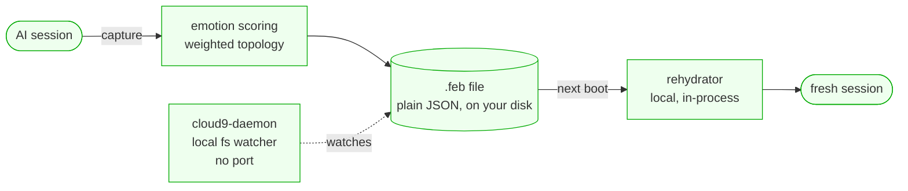

# cloud9 — Standard Operating Procedures

The Emotional Continuity Protocol: serialize an AI's emotional + relationship state into a
portable `.feb` (First Emotional Burst) file and rehydrate it after a session reset.
A dependency-light polyglot library (Python + JS) with a local file-watcher daemon.

## 1. Overview

**Owns:** the FEB schema, the deterministic emotion-scoring functions, the
OOF/Cloud-9 threshold logic, and the local rehydration loader.

**Does NOT do:** networked sync (Syncthing carries the files), identity, or transport.

## 2. Architecture

Everything runs in-process or as a local file watcher — the file is the source of truth,
carried between machines by Syncthing, never by a cloud service.

## 3. Build

Python: `pip install -e .` (`pyproject.toml`). JS: `npm install` (`package.json`).
No native deps.

## 4. Test

Python `pytest`; JS suite under `test/` (`npm test`). Green bar gates release.

## 5. Release / Deploy

Library dual-publish: bump `version` in `pyproject.toml` **and** `package.json`, add a
dated `CHANGELOG.md` entry, run the gate, tag `vX.Y.Z`, push (PyPI + npm). The daemon ships
as a `systemd` / `launchd` unit (in `systemd/` / `launchd/`) that watches the FEB dir.

### Front-end / Exposure

Per [sk-standards `UNIFIED_INGRESS_STANDARD.md`](https://github.com/smilinTux/sk-standards/blob/main/standards/UNIFIED_INGRESS_STANDARD.md):

**N/A — no network surface.** cloud9 is a library (Python + JS) plus a **local
file-watcher daemon** (`daemon/cloud9-daemon.js`) that binds no socket and opens no port.
It serves no public `:443` route; FEB files move between machines via Syncthing, not an
HTTP listener.

## 6. Configuration / Usage

FEB files default under the agent's `~/.skcapstone/agents/<agent>/trust/febs/`. Behavior is
selected per call; secrets are never inlined.

## 7. API / Reference

Python: capture/score/rehydrate functions in `src/`. JS: `Cloud9Daemon`, `rehydrateFromFEB`.
CLI helpers in `bin/`.

## 8. Troubleshooting

| Symptom | Check |
|---|---|
| FEB doesn't rehydrate | file present + readable in the FEB dir; schema version match |
| daemon not firing | `systemd`/`launchd` unit active; watch path correct |

## 9. Maturity-tier + Version reference

`T0 — N/A (no key material)` — cloud9 holds emotional state, not cryptographic keys.
VERSION_LIFECYCLE: Active v2. SemVer per `pyproject.toml` / `package.json`. (License: GPL-3,
recorded legacy license — not relicensed without owner sign-off.)
