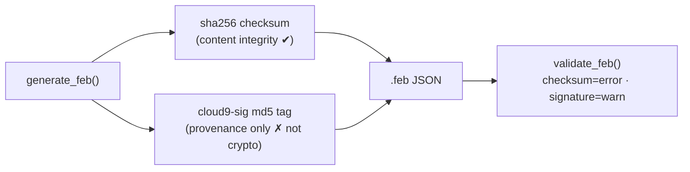
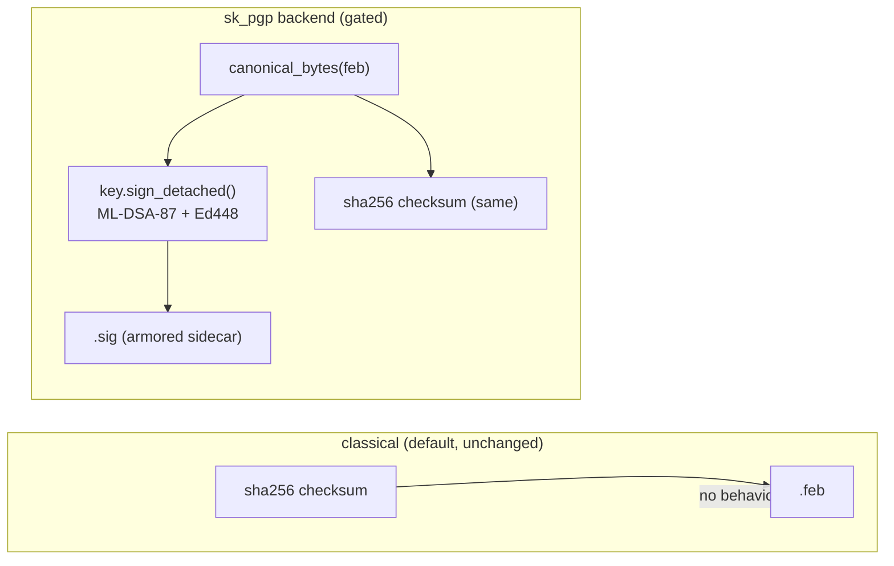
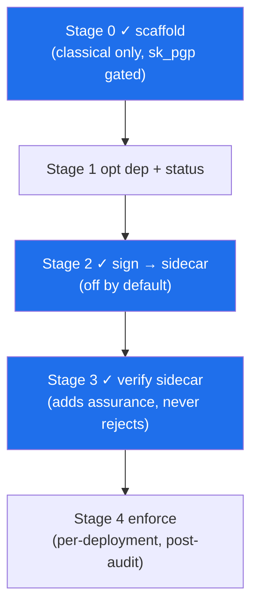

# cloud9 — Post-Quantum Migration Path (classical → `sk_pgp` composite)

> **Status: WIRED-BUT-GATED (Stage-2 write + Stage-3 read landed).** The
> post-quantum path is now *actually called* on `save_feb` (writes a `<feb>.sig`
> detached-signature sidecar) and verified on `rehydrate_from_feb` — but it
> stays **inert by default**. The classical default is unchanged **byte-for-byte**
> (no sidecar, no new return keys, identical FEB JSON); the `sk_pgp` backend
> only signs when *explicitly* selected **and** a key is present, otherwise it
> *honestly falls back to classical*. This doc + `cloud9/sealing.py` keep the
> swap a **configuration change**, never a rewrite — and it can **never break
> verification of an existing FEB.**

This document inventories cloud9's *real* current integrity handling, defines
the `sk_pgp` composite **ML-DSA-87 + Ed448** target, and lays out a staged,
honestly-gated rollout.

---

## 0. Honest claims (read first)

- ML-DSA (FIPS 204) and ML-KEM (FIPS 203) are **post-quantum / quantum-resistant**
  algorithms. They are **NOT** "quantum-proof," "quantum-safe," or "unbreakable."
  Lattice cryptography is young; the defensible words are *post-quantum* and
  *quantum-resistant*.
- The signing target is a **hybrid composite**: lattice **ML-DSA-87** (FIPS 204)
  **+** classical **Ed448** (RFC 8032). A composite signature is valid **iff BOTH
  legs verify** — the AND is enforced inside `sequoia-openpgp`, not by cloud9.
  Hybrid means *if one leg's math falls, the other still stands* — it is belt-and-
  suspenders, not magic.
- cloud9 adds **no cryptography of its own.** All PQC assurance rests on
  [`sk_pgp`](https://github.com/smilinTux/sk_pgp) → sequoia-openpgp
  (`=2.2.0-pqc.1`) → OpenSSL 3.6 + liboqs 0.14. `sk_pgp` itself is pre-1.0 and
  **not independently security-audited** — treat it as experimental.
- Standards cited: **FIPS 203** (ML-KEM), **FIPS 204** (ML-DSA), **RFC 8032**
  (EdDSA / Ed448), **RFC 9580** (OpenPGP v6), **draft-ietf-openpgp-pqc**
  (composite PQC in OpenPGP).

---

## 1. Current classical usage — the honest inventory

cloud9's "integrity" today is **not** PGP and **not** an asymmetric signature.
It is two fields on `models.Integrity`, written in `generator.generate_feb`
(lines ~223–228) and checked in `validator.validate_feb`:

| Field | What it actually is | Strength | Source |
|---|---|---|---|
| `integrity.checksum` | `sha256:<hex>` over `feb.model_dump(exclude={"integrity"})`, `sort_keys=True` | **Real tamper-evidence** (content hash). No authorship. | `generator._sha256` |
| `integrity.signature` | `cloud9-sig-<md5>` where the MD5 is over `"{session_id}-{created_at}-{intensity}"` | **Provenance tag only.** MD5, and computed over metadata — proves nothing about content or author. | `generator._md5` |

Seeds (`seeds.generate_seed`) carry only a `sha256` checksum — same story,
content integrity but no signature.

**Validator behaviour today:** a missing `checksum` is an *error*; a missing
`signature` is only a *warning*. So FEBs already round-trip fine without any
real signature — which is exactly why the PQC rollout can be additive.



**Where 'PGP for identity/sealing' really lives:** not in this repo's code. In
SKWorld, agent identity is owned by **capauth** and the OpenPGP signing surface
is being migrated to `sk_pgp` fleet-wide (the PGPy/`gpg 2.4` replacement). cloud9
is a *consumer* of that identity — the `integrity.signature` slot is the natural
place a real capauth/`sk_pgp` agent signature belongs. This migration fills that
slot **for real**, for the first time.

---

## 2. The target — `sk_pgp` composite ML-DSA-87 + Ed448, detached, sidecar

`sk_pgp` exposes exactly the surface we need:

```python
import sk_pgp
key  = sk_pgp.Key.generate("Lumina <lumina@skworld.io>", "mldsa87-ed448", password="…")
sig  = key.sign_detached(canonical_feb_bytes, password="…")   # armored detached sig
cert = key.cert
assert cert.verify_detached(sig, canonical_feb_bytes) is True  # True iff BOTH legs
cert.fingerprint        # 64 hex (v6/RFC9580)
cert.is_post_quantum    # True
```

**Design decisions (and why):**

1. **Detached signature in a sidecar, not inside the FEB JSON.** The signature is
   written to `<feb>.sig` (armored), *not* into `integrity.signature`. This keeps:
   - the `sha256` checksum stable (it already excludes `integrity`),
   - **bit-for-bit JSON cross-compatibility with the JS/npm build** (the FEB body
     is untouched), and
   - signing/verification a pure add-on a legacy reader simply ignores.
2. **Signature is computed over the same canonical bytes as the checksum**
   (`sealing.canonical_bytes` == generator's `model_dump(exclude integrity)` +
   `sort_keys`). One canonicalisation, two artifacts (hash + sig).
3. **Composite suite default = `mldsa87-ed448` (NIST L5).** `mldsa65-ed25519`
   (L3) is offered for lighter contexts. Suite is config-selectable.
4. **Verification is tri-state and never harsher than today.** A FEB with no
   sidecar verifies as it does now (checksum only). A FEB *with* a sidecar must
   have both composite legs verify.



---

## 3. The seam — `cloud9/sealing.py` (already in this repo, additive)

The module exposes one interface, a config resolver, and the Stage-2/3
sidecar helpers. The write/read paths now *call* it, but **only through an
opt-in `seal_config`** — with the default (classical) backend nothing changes.

```python
from cloud9 import get_sealer, seal_status

sealer = get_sealer()            # -> ClassicalSealer (default, always)
sealer.checksum(feb)             # identical to feb.integrity.checksum today
verdict = sealer.verify(feb, feb.integrity.signature,
                        expected_checksum=feb.integrity.checksum)
verdict.ok                       # True for legacy FEBs (checksum holds, sig=None)
```

Live wiring (Stage 2/3), opt-in via `seal_config` (or `CLOUD9_SEAL_*` env):

```python
from cloud9 import save_feb, rehydrate_from_feb

cfg = {"backend": "sk_pgp", "key": "/path/agent-key.asc", "password": "…"}
res   = save_feb(feb, seal_config=cfg)          # also writes <feb>.sig sidecar
state = rehydrate_from_feb(res["filepath"], seal_config=cfg)
state["rehydration"]["seal"]["signature_ok"]    # True iff both composite legs verify
# With no seal_config (the default) neither call touches sealing: no sidecar,
# no "seal" key, byte-for-byte the same FEB as before.
```

- `ClassicalSealer` — reproduces today's behaviour exactly (verified by a test
  that asserts `feb.integrity.checksum == sealing.content_checksum(feb)`).
  Its `sign()` returns `None` **on purpose** — honest that there is no content
  signature today.
- `SkPgpSealer` — produces/verifies the composite detached signature. **Inert**
  unless `sk_pgp` imports *and* a key is configured *and* it is selected.
- `get_sealer()` — resolves backend from config/env, **defaults to classical**,
  and *falls back to classical* if PQC is requested but not ready. Enabling PQC
  can therefore never break FEB generation.

**Config (the only signal — this is the future "swap"):**

| Env var | Meaning | Default |
|---|---|---|
| `CLOUD9_SEAL_BACKEND` | `classical` \| `sk_pgp` | `classical` |
| `CLOUD9_SEAL_SCHEME` | `mldsa87-ed448` \| `mldsa65-ed25519` | `mldsa87-ed448` |
| `CLOUD9_SEAL_KEY` | path to armored secret key | — |
| `CLOUD9_SEAL_CERT` | path to armored public cert (optional) | — |
| `CLOUD9_SEAL_PASSWORD` | passphrase (prefer gpg-agent in prod) | — |

---

## 4. Staged rollout (proven-but-gated, never breaks existing FEBs)

Each stage is independently revertible. The working classical path is **never
removed.**

### Stage 0 — Scaffold (DONE, this change)
- `cloud9/sealing.py` interface + `ClassicalSealer` + gated `SkPgpSealer` +
  `get_sealer`/`seal_status`. Tests prove classical parity + PQC gating.
- No generate/rehydrate/validate behaviour changes. `sk_pgp` is **not** a
  dependency (optional extra only).

### Stage 1 — Optional dependency + diagnostics (additive)
- Add `pqc = ["sk_pgp>=0.x"]` to `pyproject.toml` `[project.optional-dependencies]`.
- Add a read-only `cloud9 seal status` CLI command surfacing `seal_status()`.
- **Gate:** nothing signs yet; purely observability.

### Stage 2 — Opt-in detached signing (write side, sidecar) — **DONE**
- `save_feb(feb, …, seal_config=…)` now calls `sealing.write_seal()` after
  writing the FEB JSON. When `CLOUD9_SEAL_BACKEND=sk_pgp` + key configured, it
  *additionally* writes `<feb>.sig` (armored composite ML-DSA + EdDSA detached
  signature over `canonical_bytes(feb)`). `fall_in_love` threads `seal_config`
  through too.
- **Gate:** off by default; absence of `sk_pgp`/key → `get_sealer` returns the
  classical sealer whose `sign()` is `None` → **no sidecar, no new return keys,
  silent classical.** Signing that raises is swallowed — persistence never fails.
- **Invariant (tested):** with the default backend the on-disk FEB body and the
  `save_feb` return dict are byte-for-byte identical to prior behaviour; the
  signed FEB is still a fully valid legacy FEB.
- Helpers added: `sealing.write_seal`, `sealing.sidecar_path_for`,
  `sealing.SIDECAR_SUFFIX` (`.sig`).

### Stage 3 — Opt-in verification (read side) — **DONE (rehydrate)**
- `rehydrate_from_feb(filepath, …, seal_config=…)` now calls
  `sealing.verify_seal()`. If a `<feb>.sig` sidecar exists it is verified and
  the verdict is attached at `state["rehydration"]["seal"]`. Missing sidecar =
  today's behaviour (the key is simply absent → zero shape change).
- A new `sealing.get_verifier()` resolves a *verification-only* sealer (needs
  only a public cert or a key to derive it — laxer than `get_sealer`, which
  gates on a signing key).
- **Gate:** verification only *adds* assurance; it never rejects a FEB that is
  valid today. A present-but-failing signature → explicit `signature_ok=False`;
  a present-but-unverifiable signature (no cert / `sk_pgp` absent) →
  `signature_ok=None` (honest "unverifiable"), `ok` still rides on the checksum.
- `validate_feb` sidecar verification remains a future follow-up (rehydrate is
  the live read path).

### Stage 4 — Enforcement (opt-in, per-deployment, far future)
- A deployment may set a strict policy ("require valid PQC sidecar for FEBs newer
  than date D"). This is a *deployment* choice, shipped off, and only after
  `sk_pgp` is audited and keys are provisioned via capauth.
- **Never** retroactively invalidates historical FEBs.



---

## 5. Invariants (what this migration promises)

1. **Existing FEB verification never breaks.** Every FEB valid today stays valid
   at every stage. The `sha256` checksum is untouched; the legacy `cloud9-sig`
   tag is preserved as-is.
2. **Default is classical, forever available.** No PQC dependency is required to
   use cloud9. `get_sealer()` returns `ClassicalSealer` unless explicitly opted in.
3. **PQC is additive and sidecar-based.** The FEB JSON body and its JS/npm
   cross-compatibility are never perturbed.
4. **Honest verdicts.** `signature_ok` is tri-state: `None` (no signature — legacy),
   `True` (both composite legs verified), `False` (present but failed). No
   silent upgrade of "unsigned" to "trusted."
5. **No live daemons touched.** The wiring is additive and gated: `save_feb` /
   `rehydrate_from_feb` gained an optional `seal_config`, defaulting to the
   classical no-op path. skchat/skcomms and the cloud9 daemon are unaffected;
   nothing signs unless a deployment explicitly opts in with a key.

---

## 6. Open items (honest TODO)

- `sk_pgp` key provisioning for agents should flow from **capauth** (identity
  source of truth), not ad-hoc files — Stage 2 should consume a capauth-issued
  agent key, with the passphrase via gpg-agent.
- ~~Confirm `sk_pgp`'s exact loader names at activation.~~ **Confirmed against
  `sk_pgp` 0.1.0:** `Key.generate(uid, suite, password=…)`,
  `Key.from_file(path)`, `key.sign_detached(bytes, password=…)` (returns armored
  **bytes** — `sealing.SkPgpSealer.sign` normalises to `str` for the text
  sidecar), `key.cert`, `Cert.from_file(path)`, `cert.verify_detached(sig_bytes,
  data_bytes)` (the verify leg re-encodes the sidecar `str` to bytes). Both
  composite legs must verify for `True`.
- Decide sidecar naming + discovery convention (`<feb>.sig` vs an `integrity`
  sub-key) once Stage 2 lands; sidecar is preferred to protect JS cross-compat.
- `sk_pgp` must clear an independent security review before any Stage 4
  enforcement.

---

## Related projects

- **[`sk_pgp`](https://github.com/smilinTux/sk_pgp)** — sovereign post-quantum
  OpenPGP for Python (PyO3 → sequoia-openpgp `2.2.0-pqc.1`); the PGPy / `gpg 2.4`
  replacement. Provides the composite **ML-DSA-87 + Ed448** signing used here.
- **[`sk-pqc`](https://github.com/smilinTux/sk-pqc-py)** — hybrid
  **X25519 + ML-KEM-768** key encapsulation (Python / Rust / Dart). Sibling KEM
  layer; site **[skpqc.skworld.io](https://skpqc.skworld.io)**.

---

Part of the **[SKWorld](https://skworld.io)** sovereign ecosystem · 🐧 smilinTux
